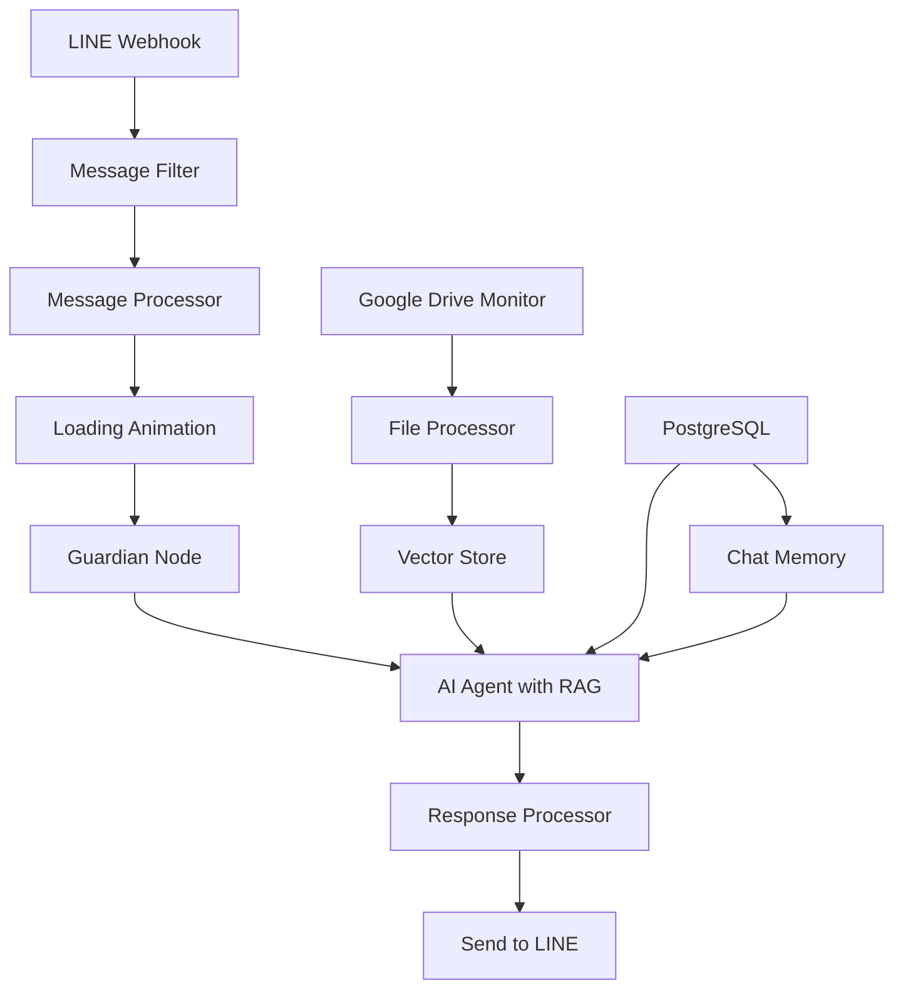

# LINE Bot with AI & RAG System

A sophisticated n8n workflow that implements an AI-powered LINE chatbot with Retrieval-Augmented Generation (RAG) capabilities, enabling intelligent document search and data analysis through conversational interface.

## 🌟 Features Overview

### �️ Guardian Node for Security
- **Prompt injection detection**
- **Content moderation**

### �💬 LINE Messaging Integration
- **Real-time messaging** via LINE Messaging API webhooks
- **Quote support** for threaded conversations
- **Loading animations** during AI processing
- **Message filtering** to handle only text messages
- **Character limit compliance** (5000 char limit with smart truncation)

### 🤖 AI-Powered Conversations
- **OpenAI GPT integration** for natural language understanding
- **Multi-language support** with automatic language detection
- **Conversation memory** using PostgreSQL storage (50 message history)
- **Context-aware responses** with quoted message handling
- **Markdown formatting removal** for clean mobile display

### 📚 RAG (Retrieval-Augmented Generation) System
- **Semantic document search** using vector embeddings
- **Google Gemini embeddings** for high-quality vectorization
- **PostgreSQL pgvector** for efficient similarity search
- **Intelligent document chunking** for optimal retrieval
- **Source citation** with page and section references

### 📁 Document Management
- **Google Drive integration** with real-time monitoring
- **Multi-format support**: PDF, Excel, Google Sheets, Google Docs, CSV, HTML
- **Automatic processing** when files are added/updated
- **Schema detection** for tabular data
- **Batch processing** for large files

### 🔍 Advanced Query Capabilities
- **Smart query routing** between RAG search and SQL analysis
- **SQL query execution** on tabular data (Excel/CSV files)
- **Document browsing** when RAG search is insufficient
- **Data analysis** with aggregations, filtering, and reporting

## 🏗️ Architecture

### Core Workflow Components



### Database Schema

#### documents
Stores vectorized document chunks for semantic search
```sql
- id: uuid (primary key)
- content: text (document chunk)
- metadata: jsonb (file info, page numbers, etc.)
- embedding: vector (pgvector embedding)
```

#### document_metadata
File metadata and schema information
```sql
- id: string (file_id)
- title: string
- url: string
- schema: string (for tabular files)
- created_at: timestamp
```

#### document_rows
Raw tabular data for SQL queries
```sql
- id: serial (primary key)
- dataset_id: string (references file_id)
- row_data: jsonb (column data)
```

## 🚀 Setup Instructions

### Prerequisites
- n8n instance (cloud or self-hosted)
- PostgreSQL database with pgvector extension
- Google Drive API access
- LINE Messaging API credentials
- OpenAI API key
- Google Gemini API key

### 1. Database Setup
```sql
-- Enable pgvector extension
CREATE EXTENSION IF NOT EXISTS vector;

-- Create tables (automatically created by workflow)
-- documents, document_metadata, document_rows tables
```

### 2. LINE Bot Configuration
1. Create a LINE Messaging API channel
2. Get Channel Access Token
3. Set webhook URL to your n8n webhook endpoint
4. Update the Authorization header in the workflow with your token

### 3. Google Drive Setup
1. Create Google Cloud project
2. Enable Google Drive API
3. Create OAuth2 credentials
4. Configure monitored folders in the workflow
5. Update folder URLs in the Google Drive trigger nodes

### 4. API Keys Configuration
Update the following in your n8n workflow:
- OpenAI API key in the AI Language Model node
- Google Gemini API key in the Embeddings nodes
- PostgreSQL connection credentials
- LINE Channel Access Token

### 5. Deploy Workflow
1. Import the `prod.json` file into your n8n instance
2. Configure all credential connections
3. Activate the workflow
4. Test with a LINE message

## 🔧 Configuration

### Message Processing Settings
```javascript
// In Message Processor node
shouldQuoteInResponse: true  // Enable/disable message quoting
```

### AI Agent System Prompt
The AI agent is configured with a comprehensive system prompt that:
- Prioritizes RAG search for general questions
- Uses SQL queries for data analysis
- Provides source citations
- Handles multi-language responses
- Maintains conversation context

### File Processing
Supported file types and processing:
- **PDF**: Text extraction for semantic search
- **Excel/CSV**: Schema detection + tabular data storage
- **Google Docs**: HTML to text conversion
- **Google Sheets**: Data export and processing

## 🛠️ Tools Available to AI Agent

### 1. Document Search (RAG)
```javascript
// Semantic search through document vectors
// Automatically triggered for general questions
```

### 2. Document Listing
```sql
SELECT * FROM document_metadata;
-- Lists all available documents with metadata
```

### 3. File Content Extraction
```sql
SELECT string_agg(content, ' ') as document_text
FROM documents
WHERE metadata->>'file_id' = $1;
-- Extracts full text from specific document
```

### 4. SQL Data Analysis
```sql
-- Example queries on tabular data
SELECT AVG((row_data->>'revenue')::numeric)
FROM document_rows
WHERE dataset_id = 'file_id';

SELECT 
    row_data->>'category' as category,
    SUM((row_data->>'sales')::numeric) as total_sales
FROM document_rows
WHERE dataset_id = 'file_id'
GROUP BY row_data->>'category';
```

## 📊 Usage Examples

### General Q&A
```
User: "What is our company policy on remote work?"
Bot: [Searches documents] → Returns policy with source citation
```

### Data Analysis
```
User: "What were our total sales last quarter?"
Bot: [Queries sales spreadsheet] → Returns aggregated data with breakdown
```

### Document Discovery
```
User: "What documents do you have about marketing?"
Bot: [Lists relevant documents] → Shows available marketing-related files
```

## 🔍 Monitoring & Debugging

### Workflow Execution
- Monitor n8n execution logs for errors
- Check webhook delivery in LINE Developer Console
- Verify database connections and queries

### Common Issues
1. **Message too long**: Automatic truncation at 5000 characters
2. **File processing failures**: Check file format and Google Drive permissions
3. **RAG not finding results**: Verify document processing and embeddings
4. **SQL errors**: Check schema detection and column names

## 🔒 Security Considerations

- Store all API keys securely in n8n credentials
- Use environment variables for sensitive configuration
- Implement rate limiting for webhook endpoints
- Regular backup of PostgreSQL database
- Monitor Google Drive folder permissions

## 📈 Performance Optimization

### Vector Search
- Optimize pgvector index settings
- Adjust chunk sizes for better retrieval
- Monitor embedding generation costs

### Database
- Regular maintenance of vector indexes
- Cleanup old conversation history
- Monitor storage usage for large files

### API Usage
- Monitor OpenAI token usage
- Implement caching for frequently asked questions
- Optimize Google Drive API calls

## 🤝 Contributing

1. Fork the repository
2. Create feature branch
3. Test changes thoroughly
4. Update documentation
5. Submit pull request

## 📝 License

This project is licensed under the MIT License - see the LICENSE file for details.

## 🆘 Support

For issues and questions:
1. Check the troubleshooting section
2. Review n8n execution logs
3. Verify all API credentials
4. Test individual workflow nodes

---

*Built with ❤️ using n8n, OpenAI, and PostgreSQL*
